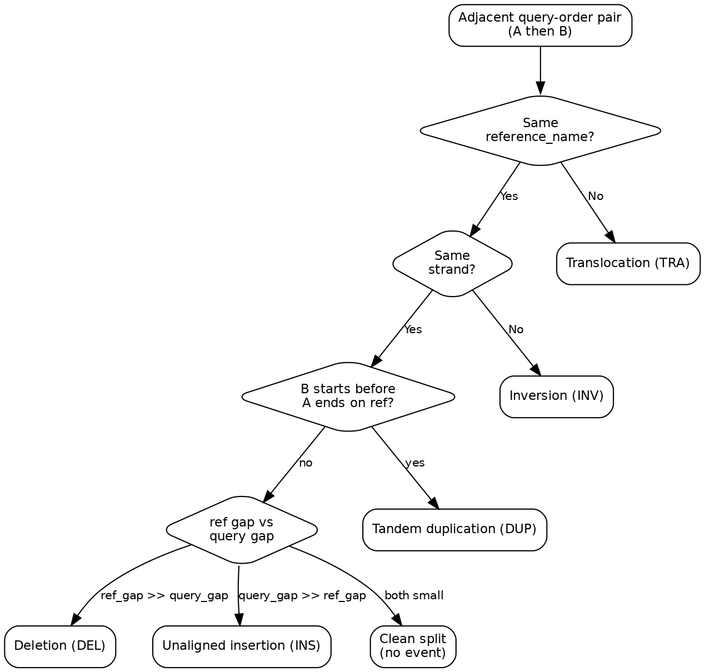

Rearrangement inference
=======================

Split-read alignments from a single molecule can be classified by comparing
adjacent mapping segments along the original read. The decision tree below
summarizes how ``infer_rearrangements`` dispatches each segment pair.

See :func:`cigarmath.rearrangement.infer_rearrangements`,
:func:`cigarmath.rearrangement.rearrangement_segment_stream`,
:func:`cigarmath.rearrangement.reference_lengths_from_pysam_header`, and
:func:`cigarmath.rearrangement.format_read_rearrangement_summary`.

When ``reference_lengths`` is supplied (e.g. from the SAM/BAM ``@SQ`` header),
genome-scale negative reference overlap is classified as **REF_WRAP** (linear
reference wrap) instead of tandem **DUP**.

**INV** uses two paths: close breakpoint proximity (default 1000 bp), or
embedded inversion when opposite-strand segments overlap substantially on the
reference with a near-contiguous query junction.

ASCII summary example::

    >>> from cigarmath.rearrangement import infer_rearrangements, format_read_rearrangement_summary
    >>> summary = format_read_rearrangement_summary(query_name, mappings, events)
    >>> print(summary)
    read my_read len=1000 segments=2 events=1
    [Clip] q[0, 100)
    [S0 +] q[100,500) ref:chr1:1000-1400
    [S1 -] q[500,900) ref:chr1:1380-1780 | INV ref -20
    [Clip] q[900, 1000)

To regenerate a full-corpus artifact from the test SAM file::

    pytest tests/test_rearrangement.py -k artifact

Then open ``tests/test_data/.rearrangement_summaries_test_sam.txt`` (git-ignored).

Diagram source
--------------

The canonical diagram source is ``rearrangements.dot`` (Graphviz). A Mermaid
version is kept in ``rearrangements.mmd`` for editors that prefer Mermaid syntax.

Regenerate the PNG after editing the decision tree::

    dot -Tpng docs/rearrangements.dot -o docs/rearrangements.png -Gdpi=150
